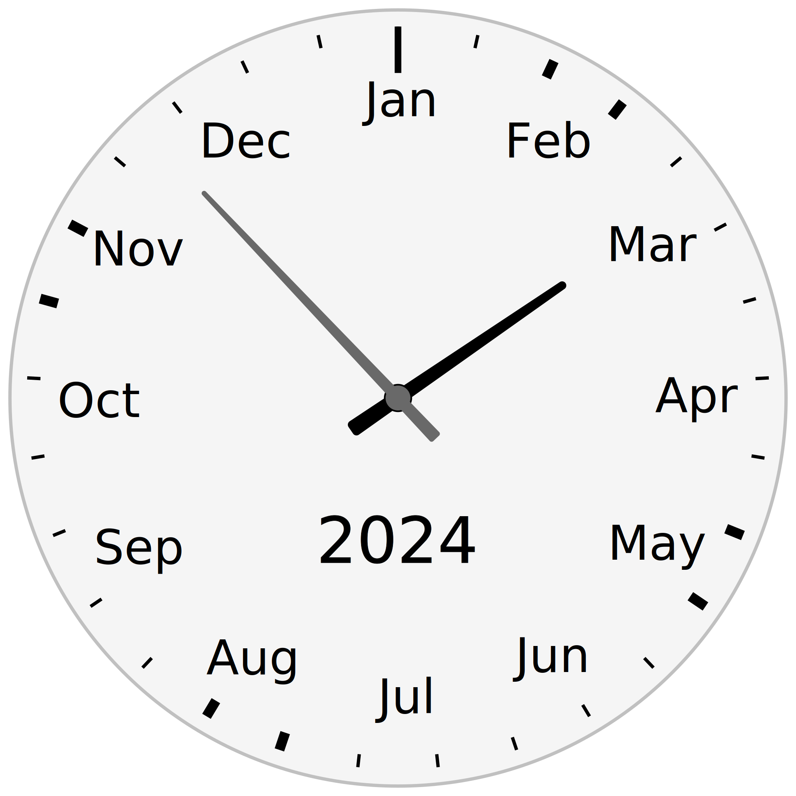

Year Clock
==========

A bit like a regular analog clock, but instead of the regular 12 hour divisions it has the 12 months of the year.

The 'hour hand' points to the time of year. In the second example the 'minute hand' points to the time of month.

	
	

> [!TIP]
> Live on github pages: [ldpercy.github.io/year-clock/](https://ldpercy.github.io/year-clock/)

Prior and current art
---------------------

It's been done many times before.

A notable example is the front face of the [Antikythera mechanism](https://en.wikipedia.org/wiki/Antikythera_mechanism), which is over two thousand years old.

(See also: https://en.wikipedia.org/wiki/Orrery)

More recent examples:

* http://year-clock.net/
* http://www.levitated.net/daily/levCelestes.html, https://forums.tumult.com/t/galileos-celestial-calendar/15896
* https://plandisc.com/en/
* https://circular-calendar.com
* https://www.theroundmethod.com/
* https://mycircularcalendar.com/

Many more examples can be found by searching for things like 'radial calendar' or 'circular calendar'.

### Year Clock by Andy Brice and Ian Brice

* http://andybrice.net/blog/2010/01/30/year-clock/
* https://www.flickr.com/photos/squidthing/albums/72157622655107168/

I've used code from [year-clock.net](http://year-clock.net) as a starting point.

A copy of the original source code is in the wiki: [wiki/year-clock.net/](<./wiki/year-clock.net/>).

I'm maintaining a theme 'brice' for the original design as seen on year-clock.net

How to run
----------

* Clone the repository
* Open the file `[path to repo]/year-clock/index.html` directly in a browser

No webserver is required, it all runs in-page.

URL Parameters
--------------

| parameter		| example							|
|---------------|-----------------------------------|
| date			| date=2023-04-05					|
| theme			| theme=brice						|
| style			| theme=car-dashboard&style=night	|
| language		| language=fr						|
| background	| background=dusk					|
| hemisphere	| hemisphere=northern				|
| test			| test=true							|

### Date

Set the clock display to a specific date, eg:

	index.html?date=2023-04-05

### Theme

Load a different theme to the default, eg:

	index.html?theme=brice

Theme 'brice' is the original design seen on [year-clock.net](<http://year-clock.net>).

### Style

Only relevant if the theme includes style variants, eg:

	index.html?theme=brice&style=dark

### Language

A small set of translations were inherited from the original, eg:

	index.html?language=fr

### Background

A few custom backgrounds are available eg:

	index.html?background=dusk

### Hemisphere

Change the hemisphere, changes some seasonal cues on some themes:

	index.html?hemisphere=northern

### Testing

Turn on some basic smoke testing:

	index.html?test=true

Theming
-------
More info: [wiki/theming.md](<./wiki/theming.md>)

> [!NOTE]
> Theming work is in progress so subject to change

Themes are in [yearclock/theme/](<./yearclock/theme/>).

Each theme is a directory `yearclock/theme/[themeName]/` with two files:

* theme.class.js - contains clock settings and the main `getClockSVG()` function
* theme.css	- regular stylesheet for the clock

Optional style variants (specified with the 'style' parameter) are stored as:

* style-[styleVariant].css	- additional css rules for the variant

Tasks
-----

More detail in the [task/](<./task/>) directory.

### Currently working on

* Solar theme
* Dynamic/interactive elements
* Custom date highlighting

### Future features

* A lunar-month hand to demonstrate moon phases
* A 'second hand' pointing to the time of day
* Calendar integration
* Conversion to TypeScript

