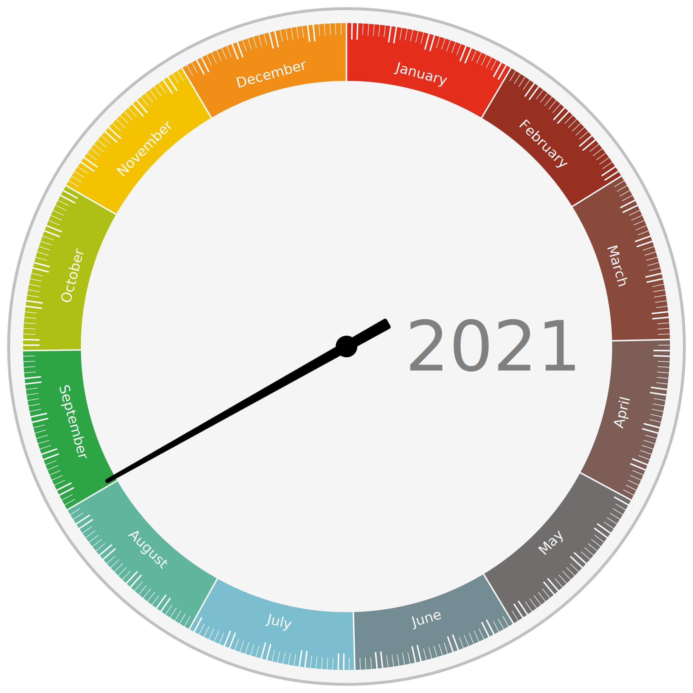

Year Clock
==========

A bit like a regular analog clock, but instead of the regular 12 hour divisions it has the 12 months of the year.

The 'hour hand' points to the time of year.

### Prior art

It's already been done of course.
Over two thousand years ago, on the front face of the [Antikythera mechanism](https://en.wikipedia.org/wiki/Antikythera_mechanism).

(See also: https://en.wikipedia.org/wiki/Orrery)

More recent examples:

* http://year-clock.net/
* http://andybrice.net/blog/2010/01/30/year-clock/
* https://www.flickr.com/photos/squidthing/sets/72157622655107168/
* http://www.levitated.net/daily/levCelestes.html
* https://forums.tumult.com/t/galileos-celestial-calendar/15896
* https://plandisc.com/en/

### Andy Brice and Ian Brice version

I've started with code from [year-clock.net](http://year-clock.net) to use as a base.

A copy of the original year-clock code is in the [year-clock.net/](<./year-clock.net/>) directory.

How to run
----------

* Clone the repository
* Open the file `[path to repo]/year-clock/yearclock/yearclock.html` directly in a browser

No webserver is required, it all runs locally.

URL Parameters
--------------

### Date

Set the clock display to a specific date, eg:

	yearclock.html?date=2023-04-05

### Theme

Load a different theme to the default, eg:

	yearclock.html?theme=brice

Theme 'brice' is the original design seen on [year-clock.net](http://year-clock.net).

### Style

Only relevant if the theme includes style variants, eg:

	yearclock.html?theme=brice&style=dark

### Language

A small set of translations were inherited from the original, eg:

	yearclock.html?language=fr

Theming
-------

> [!NOTE]
> Theming work is in progress so subject to change

Themes are in [yearclock/theme/](<./yearclock/theme/>).

Each theme is a directory `yearclock/theme/[themeName]/` with three files:

* config.js	- basic information about the theme, including specifying a 'base' theme
* style.css	- regular stylesheet for the clock
* yearclock.js - contains clock setting and the `drawClock()` function

Optional style variants (specified with the 'style' parameter) are stored as:

* style-[styleVariant].css	- additional css rules for the variant

Tasks
-----

More detail in the [task/](<./task/>) directory.

### Currently working on

* Customisable theming and styling of the clock face
* Remove callbacks from loading sequence
* Remove or minimise dependency on snap-svg
* Dynamic theme loading (no page reload)
* My own clock themes

### Future features

* A 'minute hand' pointing to the time of month
* A 'second hand' pointing to the time of day
* Calendar integration

