Year Clock
==========

A bit like a regular analog clock, but instead of the regular 12 hour divisions it has the 12 months of the year. The 'hour hand' when present points to the time of year.

	
	

> [!TIP]
> The year clock is live: [ldpercy.github.io/year-clock/](https://ldpercy.github.io/year-clock/)

Prior and current art
---------------------

It's been done many times before.

A notable example is the front face of the [Antikythera mechanism](https://en.wikipedia.org/wiki/Antikythera_mechanism), which is over two thousand years old.

(See also: https://en.wikipedia.org/wiki/Orrery)

More recent examples:

* http://year-clock.net/
* http://www.levitated.net/daily/levCelestes.html, https://forums.tumult.com/t/galileos-celestial-calendar/15896
* https://plandisc.com/en/
* https://circular-calendar.com
* https://www.theroundmethod.com/
* https://mycircularcalendar.com/

Many more examples can be found by searching for things like 'radial calendar' or 'circular calendar'.

### Year Clock by Andy Brice and Ian Brice

* http://andybrice.net/blog/2010/01/30/year-clock/
* https://www.flickr.com/photos/squidthing/albums/72157622655107168/

I've used code from [year-clock.net](http://year-clock.net) as a starting point.

A copy of the original source code is in the wiki: [wiki/year-clock.net/](<./wiki/year-clock.net/>).

I'm maintaining a theme 'brice' for the original design as seen on year-clock.net

How to run
----------

> [!IMPORTANT]
> From version 2.0 onwards year-clock will only run in `http` mode as it utilises JavaScript modules.
> Versions prior to that were runnable with `file://` protocol.

* Clone the repository
* Start up your favourite webserver, making sure the project repo is under the webroot
* Navigate to `[localhost]/year-clock/index.html` or equivalent

No installation or build is required, it runs as-is in the browser.

URL Parameters
--------------

| parameter		| example							|
|---------------|-----------------------------------|
| date			| date=2023-04-05					|
| theme			| theme=solar						|
| style			| theme=car-dashboard&style=night	|
| language		| language=fr						|
| background	| background=dusk					|
| hemisphere	| hemisphere=northern				|
| test			| test=true							|

### Date

Set the clock display to a specific date, eg:

	index.html?date=2023-04-05

### Theme

Load a different theme to the default, eg:

	index.html?theme=brice

### Style

Only relevant if the theme includes style variants, eg:

	index.html?theme=brice&style=dark

### Language

A small set of translations are available:

	index.html?language=fr

### Background

A few custom backgrounds are available eg:

	index.html?background=dusk

### Hemisphere

Set the hemisphere, changes seasonal cues on some themes:

	index.html?hemisphere=northern

### Testing

Turn on basic smoke testing - the border turns red if 'silent' JavaScript errors leak into the output (undefined, NaN etc):

	index.html?test=true

Theming
-------
More info: [wiki/theming.md](<./wiki/theming.md>)

> [!NOTE]
> Theme code is evolving so details subject to change

Themes are in [yearclock/theme/](<./yearclock/theme/>).

Each theme is a directory `yearclock/theme/[themeName]/` with two files:

* theme.js - module containing theme class, settings, and the main `getThemeSVG()` method
* theme.css	- regular stylesheet for the clock

Optional style variants (specified with the 'style' parameter) are stored as:

* style-[styleVariant].css	- additional css rules for the variant

Tasks
-----

More detail in the [task/](<./task/>) directory.

### Recently completed

* Conversion to HTTP-only and JS modules
* Conversion to HTMLApp
* 'Wheel' theme

### Currently working on

* Transition to [Temporal](https://developer.mozilla.org/en-US/docs/Web/JavaScript/Reference/Global_Objects/Temporal)
* Better use of JS classes
* A solar theme that demonstrates moon phases
* More dynamic/interactive elements
* Custom date/event highlighting

### Future work

* A live 'second hand' that points to the time of day
* Calendar integration/import
* New themes: space, 'fire danger', retro, roman
* Revisit translations

